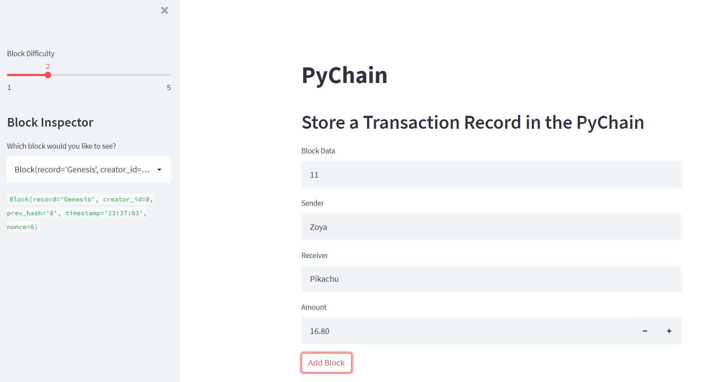
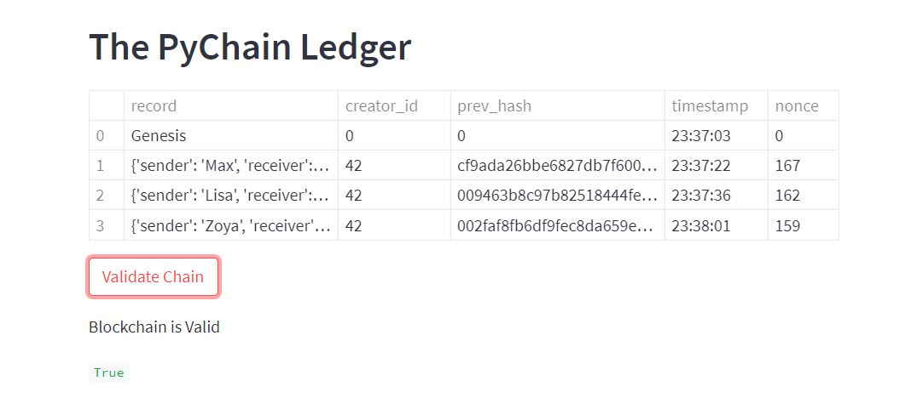
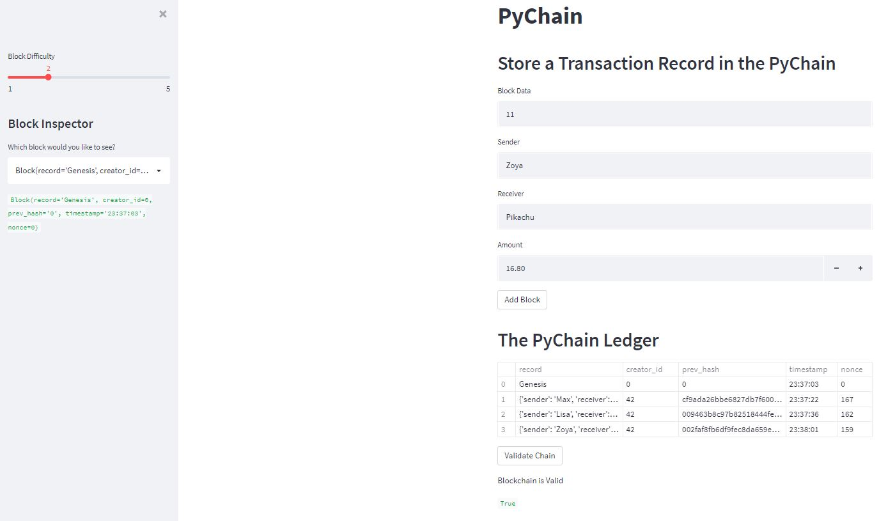

<!-- Find and Replace All [repo_name] -->
<!-- Replace [product-screenshot] [product-url] -->
<!-- Other Badgets https://naereen.github.io/badges/ -->

[![Contributors][contributors-shield]][contributors-url]
[![Forks][forks-shield]][forks-url]
[![Stargazers][stars-shield]][stars-url]

# Blockchain-based-ledger-system

The repository represents a blockchain-based ledger system with a user-friendly web interface. This ledger allows partner banks to conduct financial transactions (that is, to transfer money between senders and receivers) and to verify the integrity of the data in the ledger. It is a simple version for learning purposes.

---

## Approach

Step 1: Create a Record Data Class that repponsible for hashing.

Step 2: Create Chain class that repsponsible for adding blocks to chain and validation blockchain.

Step 3: Create UI with Streamlit service

Step 4: Testing

---

## Technologies

This project leverages the following tools for financial analysis:

- [Conda](https://docs.conda.io/en/latest/) - source package management system and environment management system.

- [Pandas](https://pandas.pydata.org) - Python library that’s designed specifically for data analysis.

- [Streamlit](https://streamlit.io) - Streamlit turns data scripts into shareable web apps.

- [Python](https://www.python.org) - is a programming language.

Libraries:

```
import streamlit as st
from dataclasses import dataclass
from typing import Any, List
import datetime as datetime
import pandas as pd
import hashlib
```

---

## How to run

1. Install Streamlit `pip install streamlit`

2. Clone the repository `git clone https://github.com/VladislavGlupak/Blockchain-based-ledger-system.git`

3. Go to repository folder and run `streamlit run pychain.py`

4. You will see simple user interface which allows to learn basic blockchain principles, such as creating block, hashing block, adding block to chain, verificationofthe blockchain.

---

## Example of running

The user can see several blocks created and added into the chain.
Also, the user can see result of verification of the blockchain (`True`).

Step by step:

1. Input data, select `block difficulty` and click `Add block`.



2. Check the chain and click `Validate chain`.



3. Full screen



---

## Contributors

Glupak Vladislav [Linkedin](https://www.linkedin.com/in/vladislav-glupak/)

<!-- MARKDOWN LINKS & IMAGES -->
<!-- https://www.markdownguide.org/basic-syntax/#reference-style-links -->

[contributors-shield]: https://img.shields.io/github/contributors/VladislavGlupak/Blockchain-based-ledger-system.svg?style=for-the-badge
[contributors-url]: https://github.com/VladislavGlupak/Blockchain-based-ledger-system/graphs/contributors
[forks-shield]: https://img.shields.io/github/forks/VladislavGlupak/Blockchain-based-ledger-system.svg?style=for-the-badge
[forks-url]: https://github.com/VladislavGlupak/Blockchain-based-ledger-system/network/members
[stars-shield]: https://img.shields.io/github/stars/VladislavGlupakBlockchain-based-ledger-system.svg?style=for-the-badge
[stars-url]: https://github.com/VladislavGlupak/Blockchain-based-ledger-system/stargazers
[issues-shield]: https://img.shields.io/github/issues/VladislavGlupak/Blockchain-based-ledger-system/network/members?style=for-the-badge
[issues-url]: https://github.com/VladislavGlupak/Blockchain-based-ledger-system/issues

## License

[](https://opensource.org/licenses/MIT)
